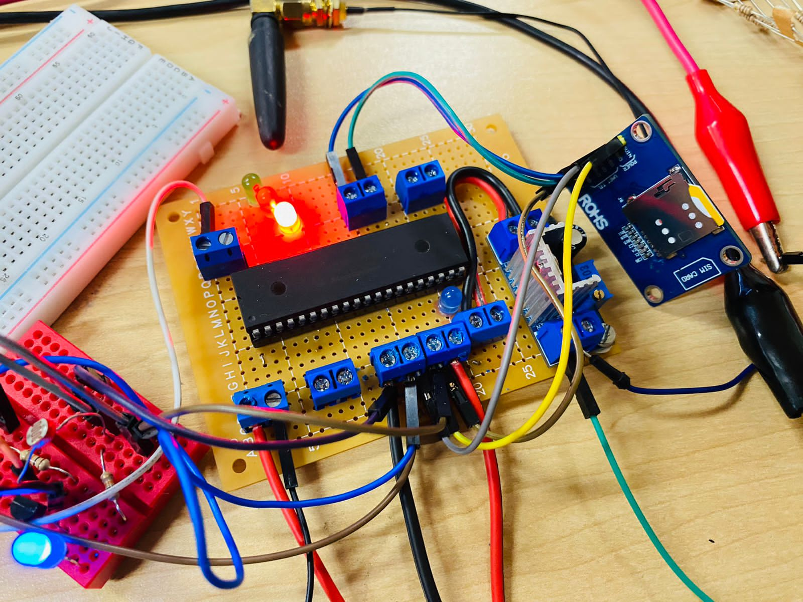

Firmware projects using PIC18F4550 Microcontroller
==================================================

Embedded systems software fo written in C programming language for PIC18F4550 microcontrollers.

There are various development environments available for the PIC18f4550 controller but folling are steps through which the said microcontroller could be programmed using MPLABX IDE:

**How to progam the PIC Microcontroller**

I use the following IDEs for development:

MPLABX IDE

  - XC8, or sometimes Hi-Tech

After code development, for loading flash memory we can use this kit

  - PIC kit1, PIC kit2, PIC kit3 or PIC kit4

MPLABX IDE is an Integrated Development Environment that is developed by Microchip and is used to develop a code for PIC microcontrollers.

Here are some useful links to help one get start with MPLABX IDE.

  1. Download compiler XC8 here: http://www.microchip.com/mplab/compilers
  2. Download MPLABX IDE here: http://www.microchip.com/mplab/mplab-x-ide

